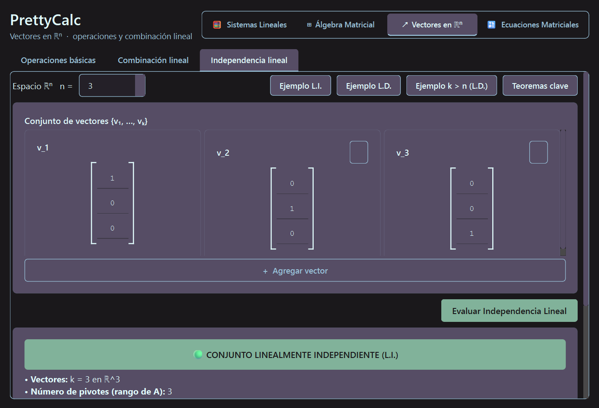
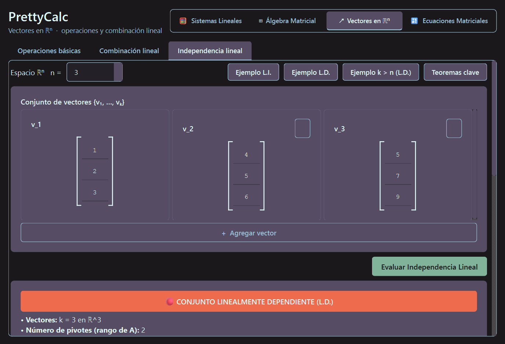
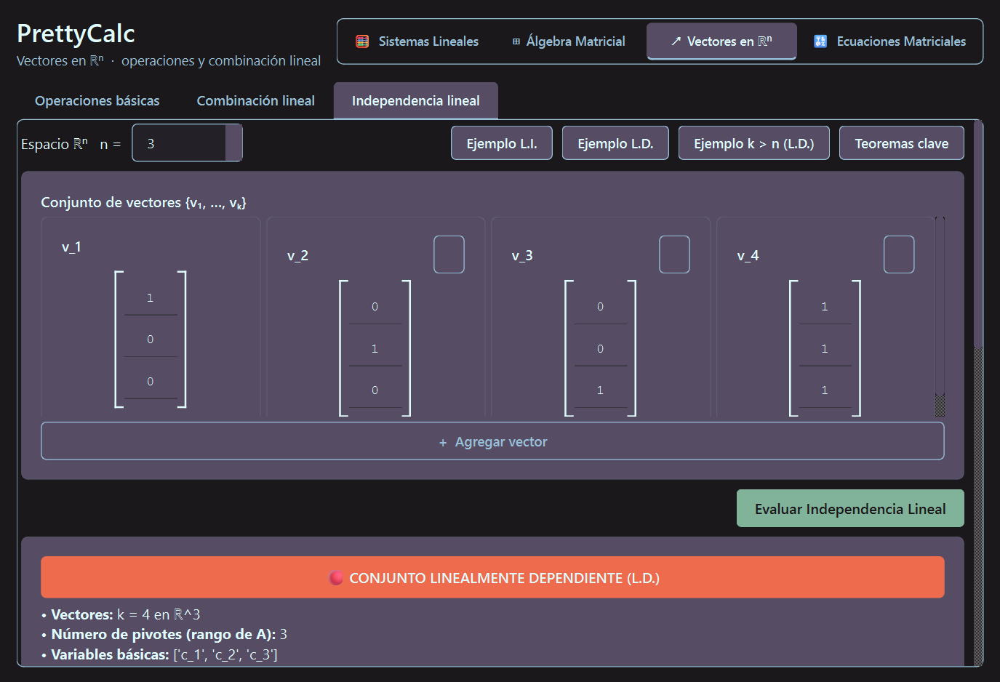

# UNIVERSIDAD AMERICANA (UAM)
## Facultad de Ingeniería y Arquitectura (FIA)
### Asignatura: Álgebra Lineal (MTM0120)
### Proyecto Integrador — Entrega Programa 4

---

# INFORME TÉCNICO: EVALUADOR DE INDEPENDENCIA Y DEPENDENCIA LINEAL EN $\mathbb{R}^n$ Y ARQUITECTURA MODULAR

* **Docente:** [Nombre del Docente]
* **Integrantes del Grupo 4:**
  * Natanael [Apellidos] (Carnet: [Número])
  * Roberto Fabio T. [Apellidos] (Carnet: [Número])
  * [Integrante 3] [Apellidos] (Carnet: [Número])
* **Carrera:** Ingeniería en Sistemas de Información / Software
* **Fecha:** Septiembre de 2026
* **Semestre:** 4

---

## 1. Introducción y Objetivos

El presente trabajo aborda la implementación computacional en **Python estándar (100% puro, sin librerías externas de álgebra lineal como NumPy, SciPy o SymPy)** de un algoritmo riguroso para determinar si un conjunto arbitrario de $k$ vectores en el espacio euclidiano $\mathbb{R}^n$ es **Linealmente Independiente (L.I.)** o **Linealmente Dependiente (L.D.)**. 

Asimismo, como parte del Proyecto Integrador, se implementa una **Arquitectura Modular Profesional** (`Calculadora_Algebra_Lineal/`) con identidad visual en arte ASCII y visualización interactiva de teoremas clave en pantalla.

---

## 2. Fundamentación Teórica y Lógica del Algoritmo

### 2.1. Definición Vectorial
Dado un conjunto de $k$ vectores $\{v_1, v_2, \dots, v_k\} \subset \mathbb{R}^n$, su combinación lineal igualada al vector nulo define la ecuación vectorial homogénea:
$$c_1 v_1 + c_2 v_2 + \dots + c_k v_k = \mathbf{0}$$

* **Linealmente Independiente (L.I.):** Si la única colección de escalares que satisface la igualdad es la **solución trivial**:
  $$c_1 = c_2 = \dots = c_k = 0$$
* **Linealmente Dependiente (L.D.):** Si existen escalares $c_1, \dots, c_k$, **no todos nulos** ($\exists c_i \neq 0$), tales que la igualdad se cumple. En términos geométricos, al menos uno de los vectores puede expresarse como combinación lineal de los demás.

### 2.2. Modelado Matricial Homogéneo
La ecuación vectorial es equivalente al sistema de ecuaciones lineales homogéneo:
$$A \mathbf{c} = \mathbf{0}$$
Donde:
* $A = \begin{bmatrix} v_1 & v_2 & \dots & v_k \end{bmatrix}$ es una matriz de coeficientes de tamaño $n \times k$ cuyas columnas corresponden ordenadamente a los vectores dados.
* $\mathbf{c} = [c_1, c_2, \dots, c_k]^T$ es el vector columna de incógnitas ($k \times 1$).
* La matriz aumentada del sistema es $[A \mid \mathbf{0}]$ de dimensiones $n \times (k + 1)$.

### 2.3. Reducción a Forma Escalonada por Filas (REF)
Para resolver el sistema sin pérdidas de precisión por redondeo flotante, toda la aritmética se modela mediante la clase estándar `fractions.Fraction`. Se aplica el algoritmo de **Eliminación Gaussiana**:
1. **Selección de Pivotes:** En cada columna $j \in \{1, \dots, k\}$, se busca el primer elemento no nulo desde la fila pivote hacia abajo.
2. **Intercambio Elemental ($f_i \leftrightarrow f_j$):** Si el pivote no se halla en la fila actual, se realiza una permutación de filas.
3. **Eliminación Hacia Adelante ($f_r \to f_r + k \cdot f_p$):** Se anulan todos los elementos situados estrictamente por debajo del pivote.

Al finalizar la reducción, se obtiene la matriz en **Forma Escalonada por Filas (REF)** y se cuenta el número exacto de posiciones pivote $r = \text{rango}(A)$.

### 2.4. Criterio de Decisión y Veredicto Explícito
* **Si $r = k$ (Número de pivotes igual al número de vectores):**
  * Cada columna de $A$ posee una posición pivote.
  * No existen variables libres ($k - r = 0$).
  * La única solución posible del sistema homogéneo es la solución trivial $\mathbf{c} = \mathbf{0}$.
  * **Veredicto Teórico:** **LINEALMENTE INDEPENDIENTE (L.I.)**.
* **Si $r < k$ (Número de pivotes menor al número de vectores):**
  * Existen exactamente $k - r \ge 1$ variables libres (columnas sin pivote).
  * La presencia de variables libres garantiza la existencia de infinitas soluciones no triviales ($\mathbf{c} \neq \mathbf{0}$).
  * **Veredicto Teórico:** **LINEALMENTE DEPENDIENTE (L.D.)**.

### 2.5. Teoremas Especiales Automatizados
* **Teorema de la Dimensión ($k > n$):** Si la cantidad de vectores supera la dimensión del espacio ($k > n$), la matriz $A$ tiene más columnas que filas. Dado que a lo sumo puede haber un pivote por fila ($r \le n < k$), siempre habrá al menos $k - n$ variables libres. El sistema es **necesariamente L.D.**
* **Teorema del Vector Nulo:** Si el conjunto incluye el vector $\mathbf{0}$, el algoritmo detecta de inmediato que el conjunto es L.D., pues $1 \cdot \mathbf{0} + 0 \cdot v_2 + \dots = \mathbf{0}$ es una solución no trivial.
* **Construcción de Dependencia No Trivial:** Cuando el conjunto resulta L.D., el programa calcula mediante Gauss-Jordan una combinación concreta $\sum c_i v_i = \mathbf{0}$ con $\mathbf{c} \neq \mathbf{0}$ y comprueba la anulación componente a componente.

---

## 3. Arquitectura Modular del Proyecto (`Calculadora_Algebra_Lineal/`)

El proyecto fue reorganizado en una estructura modular escalable:

```text
Calculadora_Algebra_Lineal/
├── main.py                     # Punto de entrada con Menú Principal
├── modulos/
│   ├── modulo_sistemas.py      # SEL por Gauss y Gauss-Jordan (Logo SEL)
│   ├── modulo_vectores.py      # Vectores, Combinación y L.I./L.D. (Logo Vectores)
│   ├── modulo_matrices.py      # A±B, kA, AB, Transpuesta e Inversa (Logo Matrices)
│   └── modulo_determinantes.py # 2x2, 3x3 Sarrus y nxn Triangulación (Logo Det)
└── teoremas/
    └── resumen_teoremas.py     # Despliegue interactivo de Teoremas (Opción 0)
```

Cada módulo incorpora su respectivo **Logotipo ASCII Art** y la opción obligatoria:
> `0. Ver Teoremas Clave del Módulo`

---

## 4. Pruebas y Evidencias de Ejecución (Capturas de Pantalla)

### Caso de Prueba 1: Conjunto Linealmente Independiente (L.I.) en $\mathbb{R}^3$
* **Entrada:** $k = 3$ vectores en $\mathbb{R}^3$:
  $$v_1 = (1, 0, 0)^T, \quad v_2 = (0, 1, 0)^T, \quad v_3 = (0, 0, 1)^T$$
* **Matriz Homogénea Inicial:**
  $$\begin{bmatrix} 1 & 0 & 0 & \mid & 0 \\ 0 & 1 & 0 & \mid & 0 \\ 0 & 0 & 1 & \mid & 0 \end{bmatrix}$$
* **Resultado del Programa:**
  * Número de pivotes: $r = 3$.
  * Variables libres: $0$.
  * **Veredicto:** 🟢 **LINEALMENTE INDEPENDIENTE (L.I.)**.



---

### Caso de Prueba 2: Conjunto Linealmente Dependiente (L.D.) en $\mathbb{R}^3$
* **Entrada:** $k = 3$ vectores en $\mathbb{R}^3$ con dependencia explícita ($v_3 = v_1 + v_2$):
  $$v_1 = (1, 2, 3)^T, \quad v_2 = (4, 5, 6)^T, \quad v_3 = (5, 7, 9)^T$$
* **Matriz Escalonada (REF):**
  $$\begin{bmatrix} 1 & 4 & 5 & \mid & 0 \\ 0 & -3 & -3 & \mid & 0 \\ 0 & 0 & 0 & \mid & 0 \end{bmatrix}$$
* **Resultado del Programa:**
  * Número de pivotes: $r = 2$.
  * Variables libres: $1$ (variable $c_3$).
  * **Veredicto:** 🔴 **LINEALMENTE DEPENDIENTE (L.D.)**.
  * **Combinación Lineal No Trivial:** $(1) \cdot v_1 + (1) \cdot v_2 + (-1) \cdot v_3 = \mathbf{0}$.
  * Comprobación: Componente 1: $0$, Componente 2: $0$, Componente 3: $0$.



---

### Caso de Prueba 3: Teorema de Dimensión ($k > n$, 4 vectores en $\mathbb{R}^3$)
* **Entrada:** $k = 4$ vectores en $\mathbb{R}^3$:
  $$v_1 = (1, 0, 0)^T, \quad v_2 = (0, 1, 0)^T, \quad v_3 = (0, 0, 1)^T, \quad v_4 = (1, 1, 1)^T$$
* **Resultado del Programa:**
  * Alerta preliminar por Teorema Fundamental ($k = 4 > n = 3 \implies$ necesariamente L.D.).
  * Pivotes: $r = 3$.
  * Variables libres: $1$ ($c_4$).
  * **Veredicto:** 🔴 **LINEALMENTE DEPENDIENTE (L.D.)**.



---

## 5. Instrucciones para la Entrega en Moodle

El archivo `.zip` debe estructurarse conforme a la rúbrica oficial:
* **Nombre del archivo comprimido:** `Programa 4_Grupo 4_Apellido1_Apellido2.zip`
* **Contenido interno:**
  1. `Programa 4_Grupo4.py` (Script Python 100% autónomo y comentado).
  2. `Informe_Programa 4_Grupo4.pdf` (Este documento exportado a formato PDF con las capturas de pantalla adjuntas).
